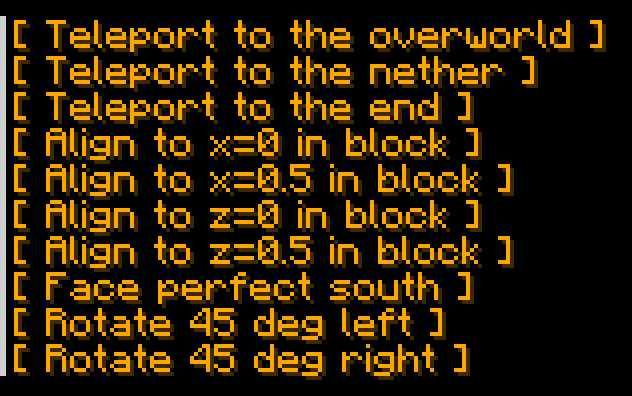

# tp-tools
> Provides helpful quick tp commands for spectators to get around easily

## Usage

Running `/trigger tptools` in spectator mode will launch a teleport menu in-chat for easily getting around. These buttons will only work if you are in spectator mode.

## Developing

To make a new release, just push a commit with a message starting with `release: ` and the rest of the message will be used as the release title.
